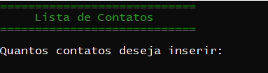
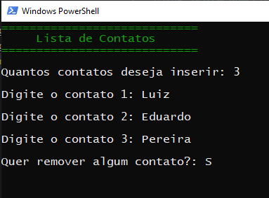
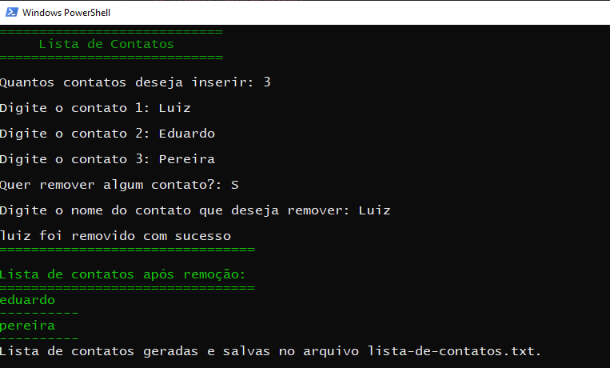
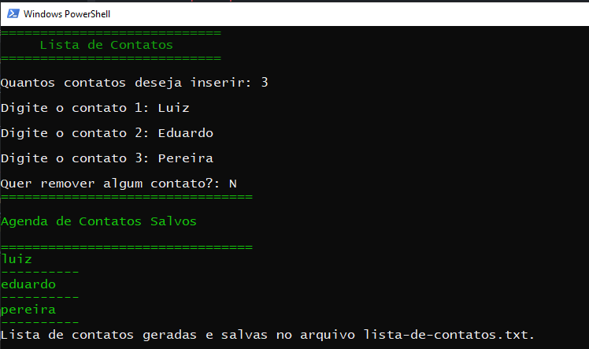
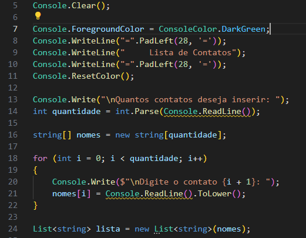
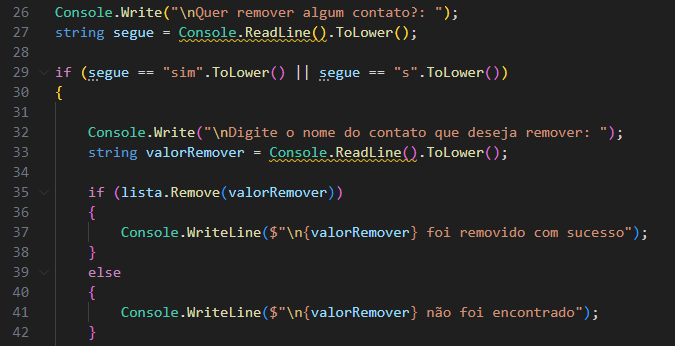
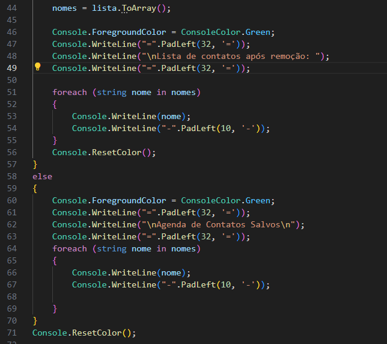

# ParaMeuCurriculo

Aluno: Luiz Eduardo Pereira 

## O que foi utilizado

* Variáveis

* Array

* For e foreach

* if e else 

* List <T>

## Etapas implementadas

* Pede ao usuário que insira a quantidade de contatos.

* Usuário insere a quantidade de contatos que deseja e os nomes dos contatos ja tendo a opção de remover os contatos caso seja da vontade do usuário

* Usuário inseri os nomes que deseja remover e os nomes são imprimidos na tela e salvos em um arquivo .txt

* Caso não queira remover nenhum contato e imprmido a lista de contato e salva no arquivo .txt 

## Backlog

* Futuras implementações :

1. Usuário possa inserir número para o contato
2. Nome dos contatos possam ser apagados sem precisar de conversão para nomes minúsculos.

## Conclusão

Resultado simples porém código foi difícil para criar devido a nova variáveis e implantação do array ler a entrada do usuário

# Prints do Código

